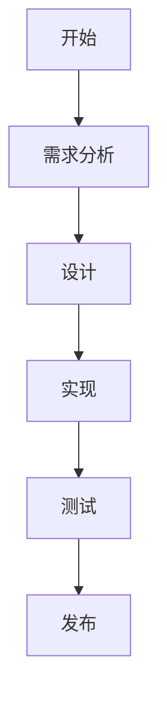

# Wallpaper Tasks

一款创新的桌面任务管理工具，将你的待办事项直接显示在桌面壁纸上，让你时刻关注重要任务而无需打开额外的应用程序。

## ✨ 特性

- 🖼️ **壁纸集成** - 任务直接显示在桌面壁纸上，简洁不干扰
- 📝 **Markdown支持** - 完整支持Markdown语法，包括:
  - 标题、列表、链接、代码块
  - 表格和引用
  - ~~删除线~~标记
  - 任务清单 ([ ] 和 [x])
- 📊 **Mermaid图表** - 在任务中嵌入流程图、时序图等
- 🔔 **系统托盘集成** - 轻松访问和管理任务
- 🔄 **实时更新** - 修改任务后壁纸自动更新
- 🎨 **美观界面** - 简洁现代的用户界面
- 🔍 **快速搜索** - 快速查找任务
- 🎯 **高效管理** - 分类、标记、优先级管理

## 📥 安装

### 方法1: 下载预编译版本

1. 访问[Releases页面](https://github.com/buynonsense/wallpaperTasks/releases)
2. 下载最新版本的`WallpaperTasks.exe`
3. 双击运行程序

### 方法2: 从源码运行

```bash
# 克隆仓库
git clone https://github.com/buynonsense/wallpaperTasks.git

# 进入目录
cd wallpaperTasks

# 安装依赖
pip install -r requirements.txt

# 运行程序
python main.py
```

## 🚀 使用方法

1. 启动程序后，它会最小化到系统托盘
2. 点击托盘图标打开主界面
3. 添加、编辑或删除任务
4. 任务会自动显示在壁纸上
5. 使用Markdown语法可以丰富任务内容的展示

### Markdown示例

```markdown
# 项目计划

## 待办事项
- [x] 规划项目范围
- [ ] 设计用户界面
- [ ] 实现核心功能

## 流程图



## 🔧 技术架构

- **前端**: PyQt6构建界面
- **后端**: Python处理逻辑和壁纸管理
- **渲染**: 使用Markdown和Mermaid渲染引擎
- **存储**: 本地文件存储任务数据

## 📋 要求

- Windows 10/11
- Python 3.7+（从源码运行时需要）
- Chrome或Edge浏览器（用于Mermaid图表渲染）

## 📄 许可证

MIT License - 查看 [LICENSE](LICENSE) 文件了解更多

## 🤝 贡献

欢迎提交Issues和Pull Requests!

1. Fork项目
2. 创建功能分支 (`git checkout -b feature/amazing-feature`)
3. 提交更改 (`git commit -m 'Add amazing feature'`)
4. 推送到分支 (`git push origin feature/amazing-feature`)
5. 打开Pull Request
